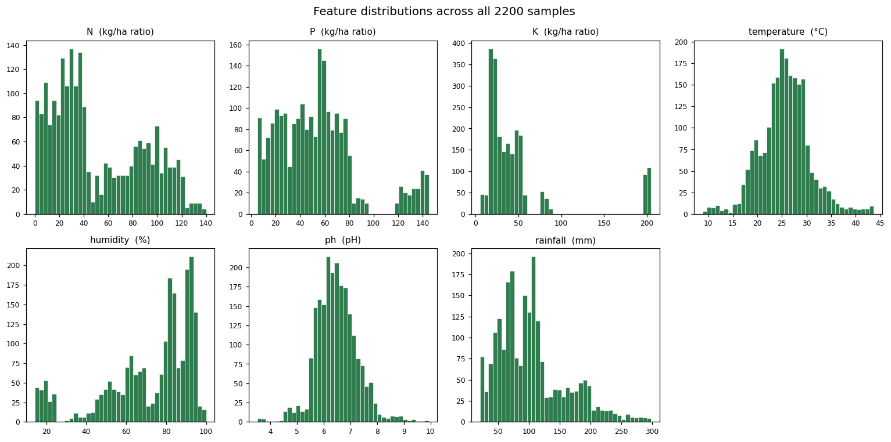
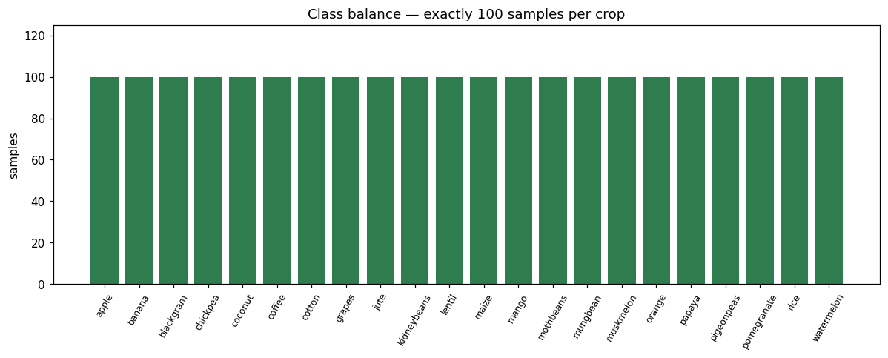
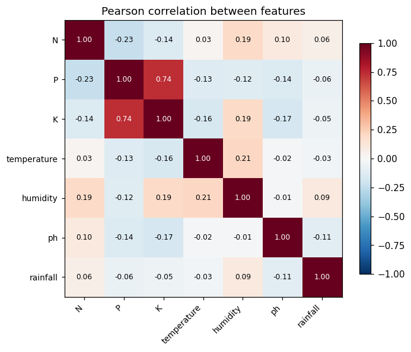
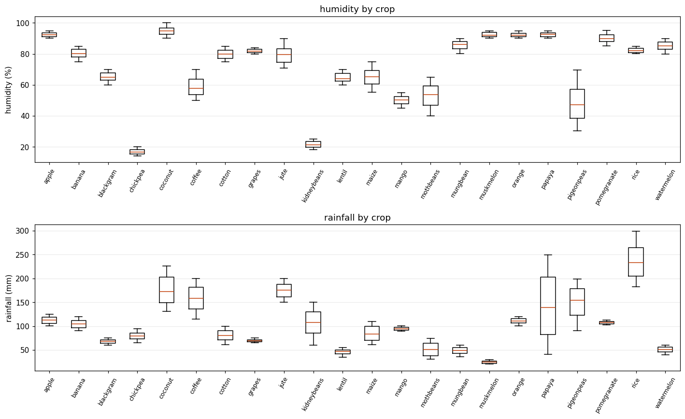
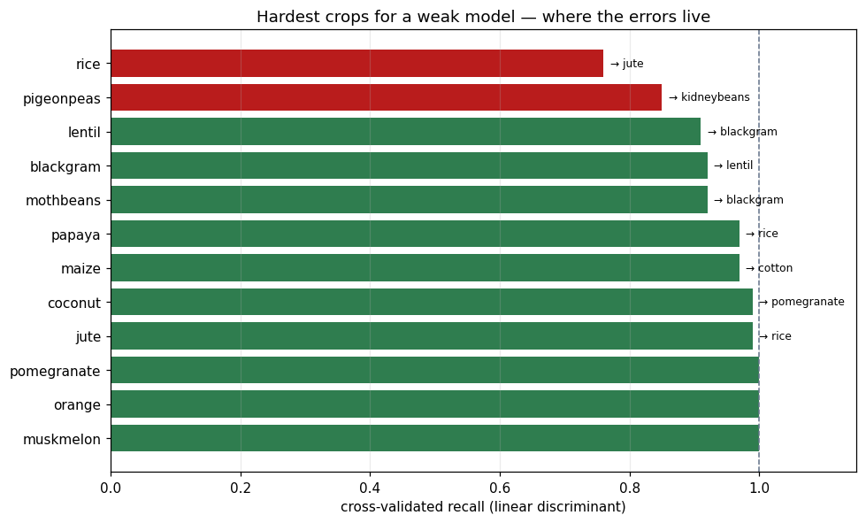
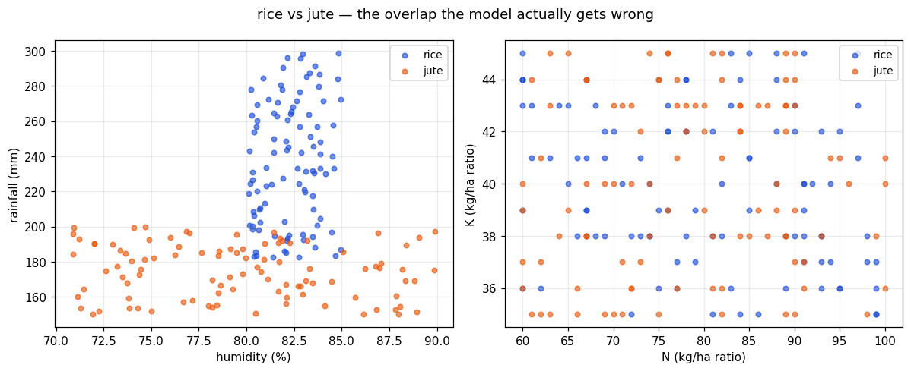

# EDA — Crop Recommendation Dataset

Generated by `eda/run_eda.py`. Every figure in this document is computed from `data/crop_data.csv` at run time.

## 1. Structure

- **2200 rows**, 7 numeric features, 22 crop classes
- **Missing cells: 0** — no imputation is needed or performed
- **Duplicate rows: 0** (duplicate feature vectors: 0)
- **Class balance: 100–100 samples per crop** — perfectly balanced, so plain accuracy is a fair headline metric and no resampling is justified

All seven features are continuous and numeric, so there is no categorical encoding step. The only transform the models need is standardisation, and that is applied inside a scikit-learn `Pipeline` so it is refit within every cross-validation fold.

## 2. Descriptive statistics

|             |   count |    mean |    std |    min |    25% |    50% |     75% |     max |   skew |   kurtosis |
|:------------|--------:|--------:|-------:|-------:|-------:|-------:|--------:|--------:|-------:|-----------:|
| N           |    2200 |  50.552 | 36.917 |  0     | 21     | 37     |  84.25  | 140     |  0.51  |     -1.058 |
| P           |    2200 |  53.363 | 32.986 |  5     | 28     | 51     |  68     | 145     |  1.011 |      0.86  |
| K           |    2200 |  48.149 | 50.648 |  5     | 20     | 32     |  49     | 205     |  2.375 |      4.449 |
| temperature |    2200 |  25.616 |  5.064 |  8.826 | 22.769 | 25.599 |  28.562 |  43.675 |  0.185 |      1.233 |
| humidity    |    2200 |  71.482 | 22.264 | 14.258 | 60.262 | 80.473 |  89.949 |  99.982 | -1.092 |      0.302 |
| ph          |    2200 |   6.469 |  0.774 |  3.505 |  5.972 |  6.425 |   6.924 |   9.935 |  0.284 |      1.656 |
| rainfall    |    2200 | 103.464 | 54.958 | 20.211 | 64.552 | 94.868 | 124.268 | 298.56  |  0.966 |      0.607 |

## 3. Outliers

Counted two ways, because the difference is the whole point:

| feature     |   global_outliers |   global_pct |   within_class_outliers |   within_class_pct |
|:------------|------------------:|-------------:|------------------------:|-------------------:|
| N           |                 0 |         0    |                       0 |                  0 |
| P           |               138 |         6.27 |                       0 |                  0 |
| K           |               200 |         9.09 |                       0 |                  0 |
| temperature |                86 |         3.91 |                       0 |                  0 |
| humidity    |                30 |         1.36 |                       0 |                  0 |
| ph          |                57 |         2.59 |                       0 |                  0 |
| rainfall    |               100 |         4.55 |                       0 |                  0 |

Every feature shows global outliers — K flags 9% of rows — and **not one of them is an outlier within its own crop.** Those points are not errors. They are the high-potassium crops (grapes, apple) and the high-rainfall crops (rice, coconut) sitting exactly where agronomy says they should. A global IQR filter would delete the signal that separates the classes, so **no outlier removal is applied** — the correct treatment here is none.

Worth noting for what it says about the data: a within-class count of exactly zero across all seven features is not what measured field data looks like. Roughly 0.7% of samples drawn from a normal distribution fall outside the 1.5×IQR fence, so ~15 would be expected here. Getting none means each crop's values are cleanly bounded with no tails — consistent with this benchmark having been at least partly generated rather than observed. See *Limitations*.

## 4. Correlation

Strongest pairs:

- `P` ↔ `K`: **+0.736**
- `N` ↔ `P`: **-0.231**
- `temperature` ↔ `humidity`: **+0.205**
- `K` ↔ `humidity`: **+0.191**

The one substantial relationship is **P ↔ K (+0.736)**, and it is agronomically real: phosphorus and potassium are applied together in compound fertiliser, and the crops that demand a lot of one (grapes, apple) demand a lot of the other. Every other pair sits below |0.3|. With seven weakly-related features there is nothing to gain from PCA or from dropping a redundant column.

## 5. How hard is this problem?

This is the finding that should govern how every accuracy number in this repository is read.

| probe | 5-fold CV accuracy |
|---|---|
| majority-class baseline | 0.0455 |
| decision tree, depth 2 | 0.1818 |
| decision tree, depth 5 | 0.4086 |
| decision tree, depth 10 | 0.9809 |
| 1-nearest neighbour | 0.9736 |
| linear discriminant | 0.9673 |

Read that table carefully, because it does not say what a quick glance suggests.

A **linear discriminant reaches 96.7%** and **1-NN reaches 97.4%** — so in the full seven-dimensional space the crops are very nearly linearly separable, and the tuned models' ~99.5% is barely an improvement on a method with no hyperparameters at all.

But a **depth-5 tree manages only 40.9%**, climbing to 98.1% at depth 10. That is the interesting half. Separability here does not come from any one feature crossing a threshold — a shallow axis-aligned model cannot express it. It comes from the *joint* configuration of all seven. Which is why depth matters so much more than the number of trees in the tuning results, and why a linear model that combines all features at once does so well while a shallow tree does not.

Per-crop recall is measured with the linear discriminant rather than the forest. That is deliberate: the tuned forest misclassifies 2 of 440 test rows, which is too few to say anything per class. A weaker model makes enough mistakes for the pattern in them to be visible.

| crop       |   recall |   precision | mistaken_for   |
|:-----------|---------:|------------:|:---------------|
| rice       |     0.76 |       0.95  | jute           |
| pigeonpeas |     0.85 |       0.988 | kidneybeans    |
| lentil     |     0.91 |       0.875 | blackgram      |
| blackgram  |     0.92 |       0.836 | lentil         |
| mothbeans  |     0.92 |       1     | blackgram      |
| papaya     |     0.97 |       1     | rice           |
| maize      |     0.97 |       1     | cotton         |
| coconut    |     0.99 |       1     | pomegranate    |

The crops that actually cost accuracy: **rice** (recall 0.76, mistaken for jute), **pigeonpeas** (recall 0.85, mistaken for kidneybeans), **lentil** (recall 0.91, mistaken for blackgram).

The rice/jute pair is the one that survives into the tuned model's errors as well. The scatter shows why: both are wet-season crops of the same river-delta conditions, and their humidity/rainfall envelopes genuinely overlap. That confusion is a property of the world, not a modelling defect — no amount of tuning removes it, and separating them would need a feature the dataset does not contain (soil texture, season, or geography).

### What this means

**A ~99% score on this dataset is mostly a property of the dataset.** A linear discriminant with nothing tuned gets within three points of a grid-searched random forest, and the gap between the top models is smaller than the fold-to-fold standard deviation. Presenting 99% as evidence of modelling skill would misrepresent the work.

The questions the headline hides are the ones worth answering:

- *Which* samples fail, and is the failure explicable? (rice ↔ jute, and rice ↔ jute)
- Is the gap between models larger than fold noise? (No — see `model_selection` in the evaluation report.)
- What does the model actually rely on? (Permutation importance, in `backend/models/evaluation_report.json`.)

## 6. Limitations

- **The dataset is synthetic.** Every crop's nitrogen range spans exactly 40, phosphorus exactly 25 and potassium exactly 10, and 97.7% of class bounds are exact multiples of 5. Within those ranges the values are uniform, not normal: 141 of 154 (class, feature) pairs are consistent with a uniform distribution and none with a normal one. Each crop occupies a near-disjoint axis-aligned box, which is why any classifier reaches ~99%. See `dataset_provenance.py`. Fine for demonstrating a workflow; unfit for agronomic advice.
- Seven features describe a field with no soil type, no season, no geography and no cultivar. Real recommendation needs all of those.
- Every row is one field-season with no temporal or spatial grouping, so a random split cannot leak across correlated units — but it also cannot measure generalisation to a *new region*, which is the deployment question that would actually matter.
